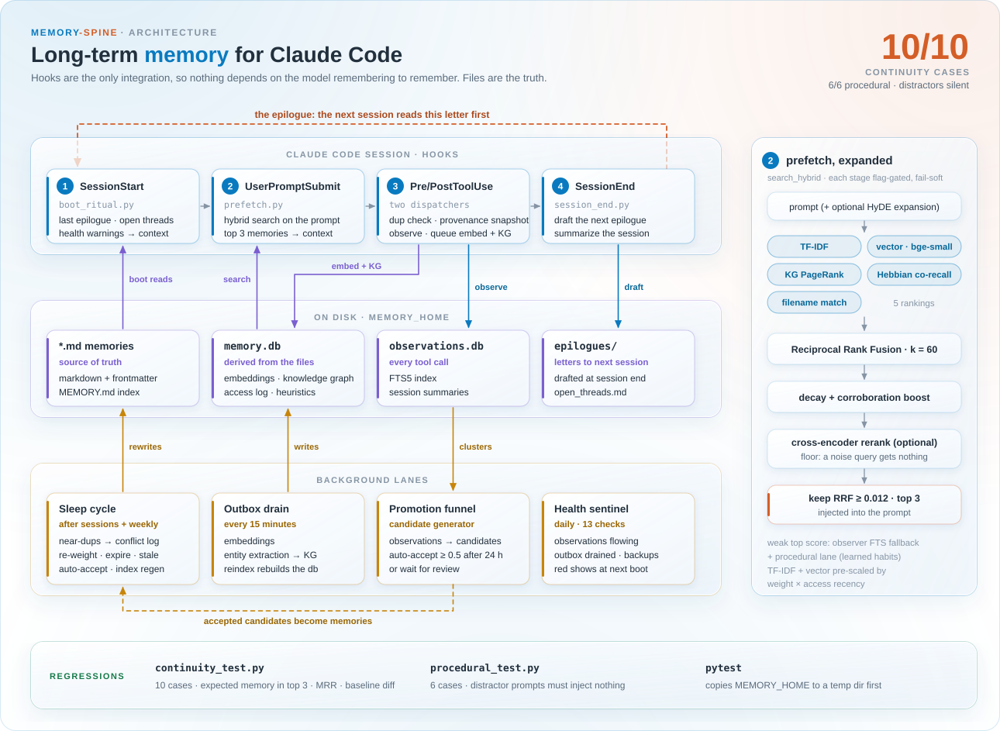

# memory-spine

A file-based long-term memory engine for [Claude Code](https://claude.com/claude-code).

Claude Code has no memory between sessions. memory-spine gives it one that is
plain markdown on disk: inspectable, greppable, version-controllable, and
owned by you. A handful of hooks read the right memories into context at the
right moment, an end-of-session ritual writes a letter to the next session,
and a background sleep cycle distills what accumulated into durable memories.
Everything runs locally: Python 3.12, sqlite, and a small embedding model.
No hosted service is involved unless you configure an LLM provider for the
synthesis passes.

It has been running daily on the author's machine since 2026-05. The numbers
in this README come from that use.

## The five layers

The layout follows the CoALA framing of agent memory, mapped to files:

| Layer | Where it lives | What goes there |
|---|---|---|
| Working | Claude's context window | handled by Claude itself |
| Episodic | `_meta/epilogues/` + `_meta/memory.db:access` | time-stamped session letters and the access log |
| Semantic | `*.md` with frontmatter | distilled facts, projects, references, decisions |
| Procedural | `feedback_*.md`, `type: procedural`, and the heuristic pool in `memory.db` | how to work with this user, how to act |
| Reflective | `type: self` | functional states and working-condition observations |

## How a session flows



1. **SessionStart** — `boot_ritual.py` prints the latest epilogue, the spine
   memories, open threads, and any health warnings into context.
   `observer_session_start.py` rotates the observer session id.
2. **UserPromptSubmit** — `prefetch.py` runs hybrid retrieval on the prompt
   and injects the relevant memories (and, when enabled, the matching
   procedural habits) as context.
3. **PreToolUse** — `pretooluse_dispatcher.py` guards protected files,
   checks a new memory for near-duplicates, snapshots the pre-edit state of
   a memory file for provenance, and serves cached reads.
4. **PostToolUse** — `posttooluse_dispatcher.py` appends to the rolling
   session log, re-embeds a memory that was just written, extracts entities
   into the knowledge graph, drains the event outbox, and records an
   observer row.
5. **SessionEnd** — `session_end.py` drafts an epilogue from the session log
   and drops a marker when the session was significant;
   `session_summarize.py` summarizes the observer stream.
6. **Sleep cycle** (scheduled) — `consolidate_worker.py` clusters epilogues,
   re-ranks weights, flags stale and expired memories, runs the procedural
   designer, and writes promotion candidates. `/consolidate` is the agentic
   pass on top: Claude reads the candidates and writes the memories.
7. **Observer → promotion funnel** — tool-call observations accumulate in
   `observations.db`; `promotion_candidate_generator.py` clusters them into
   candidates that graduate into memories after review (or automatically,
   once the trust gates are met and the flag is on).
8. **Health sentinel** (scheduled) — `health_sentinel.py` checks the data-flow
   invariants (observations flowing, outbox drained, embeddings complete,
   sleep cycle fresh, backups recent) and the boot ritual surfaces anything red.

The epilogue is the piece people ask about. At the end of a significant
session Claude writes a short letter to the next session: what happened,
what mattered, what surprised, what is still open. The next session reads
it first. It is narrative continuity, and it turned out to matter more for
"picking up where we left off" than any retrieval tuning.

## Retrieval stack

`search_hybrid` fuses several retrievers with Reciprocal Rank Fusion (k=60):

- **TF-IDF** — lexical match for rare terms, ids, and codes.
- **Vector search** — `BAAI/bge-small-en-v1.5` via fastembed, brute-force
  cosine over the stored vectors.
- **Knowledge graph + Personalized PageRank** — entities and relationships
  extracted from memories; query entities seed a PPR walk (α=0.15, 30
  iterations, edge weight = confidence × recency decay) whose scores join
  the fusion as a fourth ranking. In an ablation at 42 entities, PPR alone
  passed 25/27 continuity cases against 24/27 for the cross-encoder alone.
- **Cross-encoder rerank** (optional) — a warm rerank daemon scores the
  fused candidates; a rerank floor is the only stage that can tell a noise
  query from a real one.

Two multipliers shape the TF-IDF and vector rankings: memory weight (`high`
1.3×, `medium` 1.1×, `low` 0.9×) and recency (access frequency over 30 days
up to 1.5×, times an `exp(-age/180 days)` decay with a 0.7 floor). Hebbian
co-recall joins the fusion as its own ranking, so memories that keep getting
recalled together pull each other in; a filename match adds one top-rank
vote. Prefetch injects at most three hits that clear an RRF floor of 0.012.
Bitemporal frontmatter
(`created` vs `event_date`) lets the engine reason about "was X then, is Y
now". Adding the reranker took the continuity regression from 83% to 91%
pass rate and MRR from 0.688 to 0.891; the full v3.2 stack ended at 93% and
0.864 on the harness of that time.

Every stage is fail-soft: a dead reranker, a missing model, or a locked
database degrades retrieval, never empties it.

## Install

```bash
# 1. put the engine where the memory lives (default layout)
cd ~/.claude/projects/<your-project-slug>/memory
git clone https://github.com/mffnxman/memory-spine _scripts
cd _scripts
pip install -r requirements.txt

# 2. register the hooks and the slash commands
python install_hooks.py --commands

# 3. embed whatever memories you already have
python reindex.py
```

If the memory lives somewhere else, set `MEMORY_HOME` (the installer can
record it: `python install_hooks.py --env MEMORY_HOME=/path/to/memory`).
Other optional environment variables are documented in `paths.py`:
`OBSIDIAN_VAULT`, `MEMORY_BACKUP_DIR`, `MEMORY_USER_NAME`,
`MEMORY_OUTPUT_DIR`.

Background lanes are plain scripts; `scheduler/` has Windows Task Scheduler
wrappers and the cadence table. Cron or launchd work the same way.

Restart Claude Code after installing. The boot ritual prints on the next
session start.

## Try it without your own memories

The repo ships a synthetic starter corpus for a fictional user so the whole
pipeline can be exercised on a fresh clone:

```bash
export MEMORY_HOME=$PWD/examples/memory     # set MEMORY_HOME=... on Windows
python examples/seed_examples.py             # embeddings + KG + heuristic pool
python continuity_test.py                    # 10/10 on the shipped cases
python procedural_test.py                    # 6/6, distractors silent
python -m pytest -q                          # unit suite
```

## Layout

```
memory/                        ← MEMORY_HOME
├── MEMORY.md                  index, loaded into context every session
├── *.md                       the memories (frontmatter: name, description, type, weight)
├── _meta/                     never committed
│   ├── memory.db              access log, embeddings, KG, heuristics, telemetry
│   ├── observations.db        observer stream
│   ├── epilogues/             letters to next-me
│   ├── feature_flags.json     every stage is flag-gated for instant rollback
│   └── provenance/            pre-edit snapshots of memory files
└── _scripts/                  this repo
    ├── memory_engine.py       parsing, TF-IDF + vector search, RRF fusion
    ├── paths.py               single source of truth for locations (MEMORY_HOME)
    ├── prefetch.py · boot_ritual.py · session_end.py · session_log.py
    ├── pretooluse_dispatcher.py · posttooluse_dispatcher.py
    ├── kg.py · kg_ppr.py · kg_bootstrap.py · kg_seeds.example.json
    ├── reranker.py · rerank_daemon.py · hyde.py
    ├── hebbian.py · decay.py · bitemporal.py · importance.py
    ├── consolidate.py · consolidate_worker.py · auto_promote.py · genesis.py
    ├── observer_lib.py · observation_capture.py · promotion_candidate_generator.py
    ├── procedural_lib.py · procedural_test.py · continuity_test.py
    ├── health_sentinel.py · provenance.py · threads.py · epilogue.py
    ├── providers/             LLM providers for synthesis (Anthropic API, `claude -p`, local llama.cpp)
    ├── migrations/            schema migrations for memory.db
    ├── commands/              slash-command templates installed by install_hooks.py
    ├── scheduler/             Task Scheduler wrappers for the background lanes
    ├── examples/              synthetic starter corpus + seeder
    └── tests/                 pytest suite (isolated: never touches your memory)
```

## Frontmatter

```yaml
---
name: Short human title
description: One line, used for indexing and retrieval
type: user | feedback | procedural | project | reference | self
weight: high | medium | low        # optional, ranking tiebreaker
related: file_a.md, file_b.md      # optional, explicit cross-refs
expires: YYYY-MM-DD                # optional, auto-archive after
created: YYYY-MM-DD                # optional, when the memory was written
event_date: YYYY-MM-DD             # optional, when the described thing happened
---
```

## Slash commands

| Command | Purpose |
|---|---|
| `/recall <topic>` | Hybrid search across memories, vault, and observer |
| `/epilogue` | Write the letter to next-me |
| `/consolidate` | Sleep-cycle distillation with Claude in the loop |
| `/threads [list\|add\|close\|reopen\|rm]` | Persistent open-thread list |
| `/whoami` | What Claude currently believes about you, with a cross-ref graph |
| `/memory-audit` | Stale, orphaned, duplicate, expired memories |
| `/memory-sync` | Drift report against an Obsidian vault |
| `/graph [entity] [hops]` | Knowledge graph visualization |
| `/continuity-test` | Retrieval regression: does the right memory surface for the right query |
| `/probe [list\|diff\|drift\|new]` | Phenomenology regression: does inheritance still read the same |

## Tests

```bash
python -m pytest -q                       # unit suite; copies MEMORY_HOME to a temp dir first
python continuity_test.py [--weight core] [--baseline save|diff file.json]
python procedural_test.py [-k 5] [--baseline save|diff file.json]
python health_sentinel.py run             # data-flow invariants
```

The suite never writes to the memory it is pointed at: `tests/conftest.py`
copies the whole `MEMORY_HOME` tree to a temp directory and re-points the
engine before anything is imported.

## Design notes

- **Files are the truth.** The database holds derived state (embeddings,
  graph, access log). Delete `_meta/memory.db` and `reindex.py` rebuilds it.
- **Flags gate every stage.** `_meta/feature_flags.json` (or
  `MEMORY_FLAG_<NAME>` env vars) turns any retriever, pass, or lane off
  without a code change.
- **Hot path stays cheap.** Hooks never embed inline on the prompt path; a
  memory without an embedding is skipped and picked up by the next drain.
- **Trust gates before autonomy.** Auto-promotion of candidates into memories
  ships off and graduates through tiers (cluster size, span, corroboration)
  before anything writes to the memory directory on its own.
- **Provenance on every edit.** A pre-edit snapshot of any memory file lands
  in `_meta/provenance/` so a bad rewrite is a diff away from recovery.

## License

MIT. See `LICENSE`.
